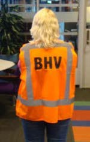

# General Safety

```{iframe} https://www.youtube.com/embed/_Vp2LcBe_jU
:width: 100%
```

## General Safety & Security at Applied Physics (AP)

In a professional organization where people are conducting complex experiments with expensive materials, safety is key. Hence, you need to be aware of general safety regulations and are obliged to pass some basic safety tests.

### Responsibilities

Safety is not something we can do on our own. We have a shared responsibility:

```{list-table} Shared responsibility
:header-rows: 1
:name: shared-responsibility
* - **TU Delft is responsible for:**
  - **You are responsible for:**
* - a safe workplace;
  - complying with the safety regulations;
* - providing you with the necessary information on safety;
  - acting in a cautious and responsible way.
* - a safety expert at your disposal.
  -  
```

### Emergencies and minor accidents

1. Call the internal alarm number +31(0)15 27 88888.

2. The emergency centre of TU Delft will send the in-house emergency response team (Bedrijfshulpverlening, BHV).

3. If needed, the emergency centre of TU Delft will contact the external emergency services.

```{note}
When in doubt, always call the internal alarm number.
```

```{warning} Internal alarm number
+31(0)15 27 88888

Save the number in your phone!
```

```{tip} Be prepared for emergencies!
Know where to find the emergency facilities (e.g. emergency exits, assembly point).
```

### In case of Site alarm/slow whoop

1. First think of your own safety.

2. Secure your work station and leave the building as soon as possible, taking the nearest exit.

3. If possible, warn your colleagues and assist people with disabilities.

4. Go to the nearest assembly point/checkpoint.

```{figure} Figures/assembly.jpg
:width: 50%

assembly point
```

5. At the assembly point/checkpoint, wait for instructions of the in-house emergency response team (Bedrijfshulpverlening, BHV).



6. Sometimes only a part of the building needs to be evacuated. If you hear a distant slow whoop you can continue to work.


### In case of Gas, smoke or fire:

1. First think of your own safety.

2. Press the red fire alarm button.

3. Extinguish small fires if you feel confident.
  - Keep in mind that a hand held fire extinguisher is empty after approx. 20 seconds.

4. If possible, warn your colleagues and assist people with disabilities.

5. Go to the nearest assembly point/checkpoint: 

```{figure} Figures/assembly.jpg
:width: 50%

assembly point
```

6. At the assembly point/checkpoint, wait for instructions of the in-house emergency response team ( Bedrijfshulpverlening, BHV).


### Incidents, accidents, near misses and unsafe situations

Incidents, accidents, near misses and unsafe situation are free lessons to learn from.

Always report incidents, accidents, near misses and unsafe situations to the Health, Safety and Environmental advisor of the faculty.


### Working outside office hours

Office hours Faculty of Applied Sciences: 7:30 – 17:00h During office hours all categories in work activities are allowed.

Outside office hours:
* Valid personal campus card for the faculty building.
* Activities category A are allowed.
* Activities category B
* Activities category C are NOT allowed.


Categories in work activities:
* A – No-risk activities.
* B – Low risk experimental activities are allowed if a knowledgeable colleague is at hearing distance.
* C – High risk activities.

### How to prevent Repetitive Strain Injury (RSI)

* Alternate between repetitive and non-repetitive work.

* Take regular breaks.

* Learn to deal with tension.

* Ensure healthy computer workstation ergonomics.

* Contact Facility Management Services to help you organizing your workplace.


### Security at TU Delft
Awareness: Circle of 25 meters

The Circle of 25 is a metaphor for the 25 meters around you.

You take extra care of your surroundings and thereby reduce safety and security risks on the TU Delft Campus.


When something occurs in your circle:

Assess the situation.
- When someone is in direct need of help you call the TU Delft Internal Alarm Number
- For non-urgent matters you contact the Service Desk.


### Campus card

Your campus card is your personal identification card on the campus as it is connected to your NetID. It provides access to:
- exams;
- printer and study facilities;
- entrances to areas (buildings, labs etc.);
- use of machinery after instruction.

Take care of your campus card and do not give it to others!

In case of loss/theft: Report to Service Desk immediately.


### Advice on Safety & Security at TU Delft Conventional safety


Anneke Koster-Ammerlaan

Health, Safety and Environmental (HSE)

Advisor, Faculty of Applied Sciences

Department of Applied Physics

Telephone number:06 42391886

E-mail: M.J.J.Koster-Ammerlaan@tudelft.nl

